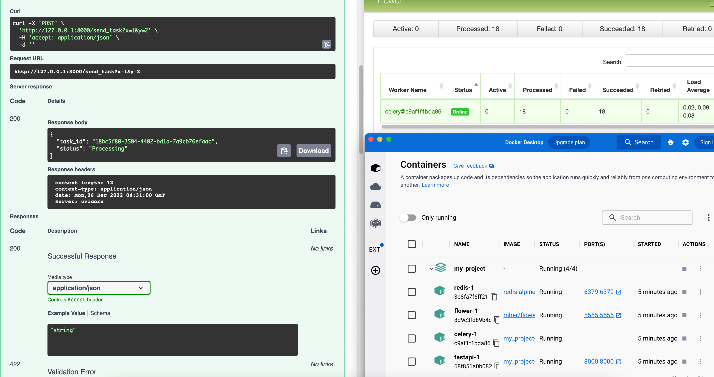

# Simple FastAPI & Celery
The project is to learn and demostrate how a FastAPI webapp communicate a remote (in a different machine) Celery worker.

## Why FastAPI
it can do async more easyly as it can utilise ASGI framework instead of WSGI. 

## Why Remote Celery
Our goal is to decouple the webapp and the worker, in particular the work runs on a remote cluster with heavy duty programme.

## Overview
+ `web_app.main.py` creates fastapi app and define two simple method to submit a task to redis and get task status from redis.
    ++ [post] `send_task`
    ++ [get] `get_task`
+ `remote_worker.celery_app.py` setups a celery app and define a task:
    ++ `trigger_task`

Both modules must have the same celery app config.

## How to use
0. you must have docker installed.
1. git clone this repo.
2. in project folder run `docker-compose build && docker-compose up`
3. use docker dashboard to see four container in action.
3. use `localhost:8000` in browser to see hello world.
4. use `localhost:8000/doc` in browser to see fastapi endpoint and to test them out.
5. use `http://localhost:5555` in browser to see flower monitoring the redis queue.

## read about 
+ https://towardsdatascience.com/deploying-ml-models-in-production-with-fastapi-and-celery-7063e539a5db
+ https://vincentblog.xyz/posts/serving-deep-learning-models-using-the-publish-subscribe-pattern
+ https://coderbook.com/@marcus/how-to-send-celery-messages-to-remote-worker/
+ https://docs.celeryq.dev/en/stable/reference/celery.html#celery.Celery.send_task